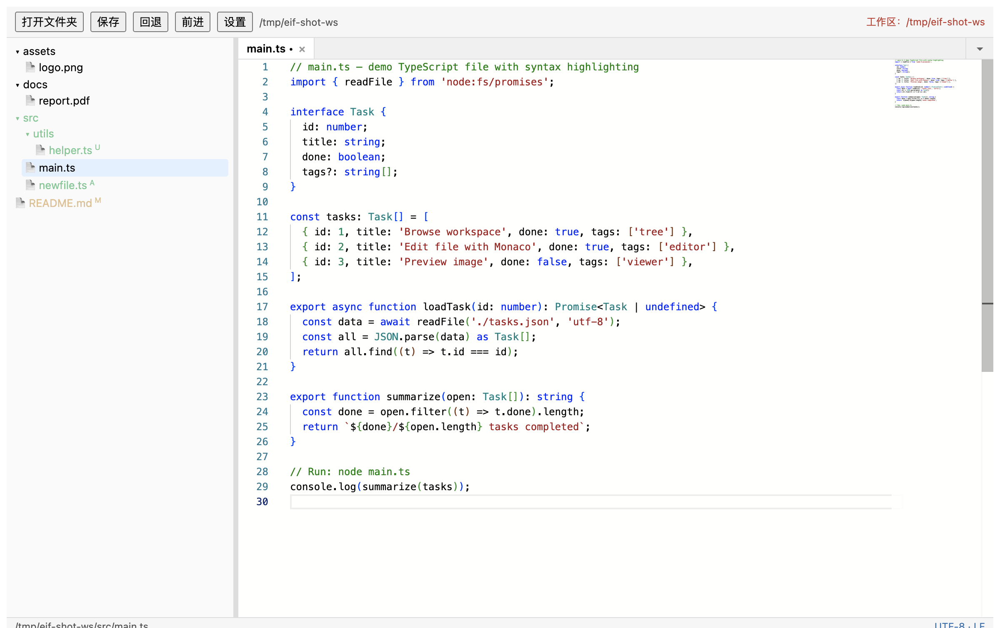
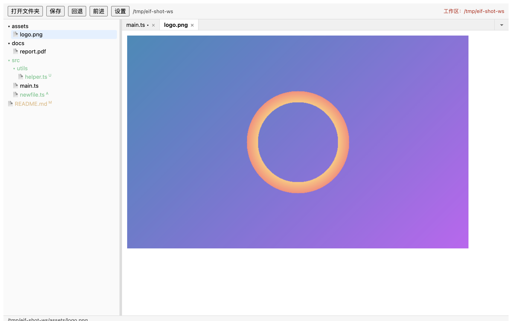
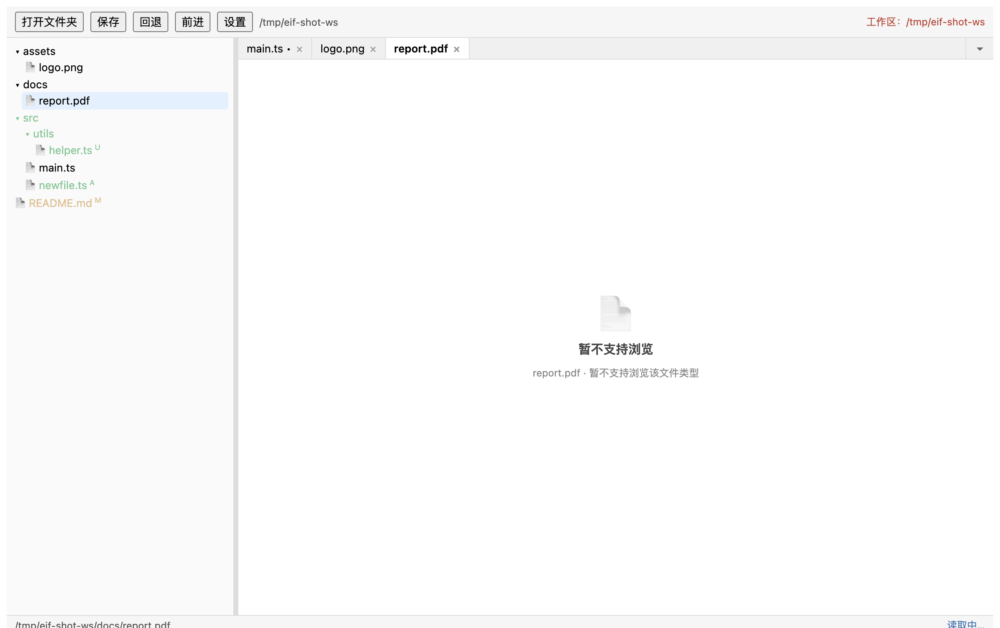
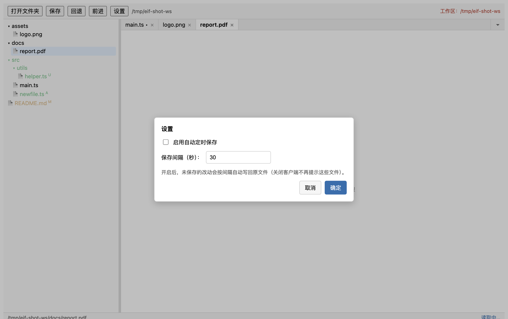

# FileEditor

[简体中文](./README.zh-CN.md)

A VSCode-style file browser & editor built with Electron — single-platform (macOS) MVP. Browse a workspace as a tree, view and edit text/code files with Monaco, preview images, and see git status at a glance.

> Design document: [docs/electron-file-editor-design.md](./docs/electron-file-editor-design.md) (authoritative; covers architecture, IPC contracts, and feature specs §1–§14 + Appendix A). Release/signing pipeline: [docs/ci-release-pipeline.md](./docs/ci-release-pipeline.md).

## Features

- **File tree browser** — open any folder as a workspace; create / rename / delete files and folders via context menu; **drag a file or folder onto another folder (or onto empty tree space) to move it**; copy absolute path.
- **Code editing** — Monaco editor (bundled **offline**, no CDN) with per-file models, dirty markers, and syntax highlighting for common languages.
- **Image preview** — common formats (png / jpg / gif / webp / svg / bmp / ico), verified by extension + magic bytes.
- **Preview scope** — text files (txt / md / json / html / yaml / csv and other decodable sources) and images are supported; binary formats (doc / docx / xlsx / ppt / pdf …) are intentionally not previewed and show a friendly unsupported notice instead of mojibake.
- **Git status highlighting** — file and folder badges for modified / untracked / added / deleted states (powered by `git status --porcelain`; non-repo workspaces are simply not decorated).
- **Live external-change sync** — chokidar watches the workspace; external edits refresh the tree, and conflict handling asks before overwriting your unsaved work.
- **Reliable editing trio** (product decision — no crash recovery / session restore):
  - **Close-confirm save** — closing the app with unsaved files prompts Save / Don't save / Cancel.
  - **Auto-save (opt-in)** — optional interval-based saving of dirty tabs, configured in Settings (persisted in `localStorage`).
  - **In-session undo / redo** — toolbar buttons wired to Monaco's per-model undo stack.
- **Resizable layout** — drag the sidebar / editor splitter to any width (160 px minimum).

## Screenshots

All screenshots live in [`docs/images/`](./docs/images/) and can be regenerated anytime with `node scripts/screenshots.mjs` (or `pnpm screenshots`) — the script spins up a dev instance, drives it over CDP, and captures the renderer viewport.

| | |
|---|---|
|  |  |
| **Main window** — file tree with git badges (M / A / U), Monaco editor with dirty-marker tab, status bar | **Image preview** — png / jpg / gif / webp / svg / bmp / ico, verified by extension + magic bytes (§6.5) |

| | |
|---|---|
|  |  |
| **Unsupported binary formats** — friendly notice instead of mojibake (§6.1 / §13) | **Settings** — opt-in auto-save with configurable interval (§14) |

> The demo workspace is rebuilt from scratch by the script (`/tmp/eif-shot-ws`), so screenshots always reflect the current build and never leak your local files.

## Tech Stack

- **Electron 44** + **electron-vite 5** (main / preload / renderer three-process build)
- **React 19** + **TypeScript 6** + **Vite 7**
- **Monaco Editor 0.56** (local workers via `?worker` imports)
- **chokidar 4** (fs watching) · **iconv-lite** (UTF-16 BOM decode; workspace text is UTF-8 no-BOM, see §6.1 of the design doc)

## Getting Started

### Prerequisites

- macOS (MVP is single-platform)
- Node.js 22+
- pnpm 11+

### Install

```bash
pnpm install
```

> **pnpm 11 build-script approval**: pnpm refuses dependency lifecycle scripts by default. This repo pre-approves `electron` and `esbuild` in `pnpm-workspace.yaml` (`allowBuilds`, with `electron-winstaller: false` — Windows-only).
>
> **⚠️ Electron ≥42 install mechanism change**: since `electron@42` the package.json **removed its postinstall script** (the installer is now exposed via the `install-electron` bin), so pnpm's `allowBuilds` no longer covers it. This repo fixed it permanently via its **own lifecycle script** — package.json `"postinstall": "node node_modules/electron/install.js"` — so every `pnpm install` automatically downloads the platform binary. No manual step needed.

### Run

```bash
pnpm start             # foreground dev (electron-vite dev)
pnpm start --daemon    # background: logs to log/dev-daemon.log, PID to pid/dev-daemon.pid
pnpm status            # check whether it is still running
pnpm stop              # stop the daemon (kills the whole process group)
```

The daemon wrapper strips `ELECTRON_RUN_AS_NODE` before spawning, so it works from any shell environment. A resident supervisor holds the PID file and cleans it up automatically when the app exits (e.g. you close the window) — no stale PID file left behind.

## Scripts

| Command | Description |
|---|---|
| `pnpm start` | Foreground dev run |
| `pnpm start --daemon` | Background dev run (`log/dev-daemon.log` / `pid/dev-daemon.pid`) |
| `pnpm status` | Check running state (valid PID file? live processes? port?) |
| `pnpm stop` | Stop the background daemon |
| `pnpm dev` | Alias of `pnpm start` (plain electron-vite dev) |
| `pnpm build` | Build all three processes to `out/` |
| `pnpm preview` | Preview the production build |
| `pnpm dist` | Package for the current platform, all arches (x64 + arm64, via `scripts/dist.mjs`) |
| `pnpm dist:mac` / `dist:win` / `dist:linux` | Per-platform packaging (dmg / NSIS exe / AppImage+deb), dual-arch by default |
| `pnpm dist:mac:x64` etc. (`:x64` / `:arm64` suffix) | Build a specific architecture only |
| `pnpm dist:all` | All platforms & arches (mac requires a macOS host; skipped elsewhere) |
| `pnpm dist --email you@example.com` | Override the maintainer email at build time (default `rouroumaibing@qq.com`) |
| `pnpm check` | **Code check**: type check + ESLint in one pass (`tsc --noEmit && eslint .`) |
| `pnpm typecheck` | Type check only (`tsc --noEmit`) |
| `pnpm lint` | ESLint only (`eslint .`) |
| `pnpm lint:fix` | ESLint with auto-fix |
| `pnpm e2e` | **UI end-to-end tests** — CDP-driven real dev instance (5 scenarios: save / reload-confirm / keep-local / auto-save / clean auto-reload; zero npm deps, ~90–120s, see `scripts/e2e/README.md`) |
| `pnpm screenshots` | Regenerate the screenshots in `docs/images/` by driving a real dev instance over CDP (see `scripts/screenshots.mjs`) |
| `pnpm clean` | Remove build output (`out/`, `dist/`) |
| `pnpm clean deep` | Also remove `node_modules/` and `pnpm-lock.yaml` (full reinstall) |

## Architecture

```
src/
├── main/          # Main process
│   ├── index.ts             # Window, close interception, IPC registration
│   ├── ipc/                 # fs / git IPC handlers
│   └── services/            # FileSystemService, GitStatusService
├── preload/       # contextBridge → window.fileAPI (typed)
├── renderer/      # React app
│   ├── App.tsx              # Layout, tabs, watch lifecycle, modals
│   ├── components/          # FileTree, CodeEditor, FilePreviewGate, ImageViewer, UnsupportedViewer, modals (Confirm/Input/CloseConfirm/Settings)
│   ├── hooks/useFileAPI.ts  # Typed IPC client
│   ├── modelRegistry.ts     # Monaco model cache (per file path)
│   └── monacoSetup.ts       # Offline Monaco + local workers
└── shared/types/  # IPC contract types (@shared alias)
```

**Security model**: `contextIsolation: true`, `nodeIntegration: false`, sandbox enabled in production (`sandbox: !isDev` — dev needs it off because the unsigned electron binary can't init the macOS App Sandbox). All privileged operations go through typed IPC handlers in the main process; the renderer never touches Node APIs directly.

## Packaging

```bash
pnpm dist             # current platform, dual-arch (x64 + arm64)
pnpm dist:mac         # → dist/FileEditor-*.dmg (x64 + arm64)
pnpm dist:mac:arm64   # Apple Silicon only (also dist:mac:x64 / dist:win:x64 / dist:linux:arm64 ...)
pnpm dist:all         # all platforms & arches (mac requires a macOS host)
pnpm dist --email you@example.com   # override deb maintainer email (default rouroumaibing@qq.com)
```

All three platforms × both architectures (x64/arm64). macOS artifacts can only be built on macOS; win/linux can cross-build (the reliable path is the 3-OS CI matrix). The project has no native dependencies, so building for a different architecture needs no extra toolchain.

macOS packaging uses hardened runtime + entitlements (`build/entitlements.mac.plist`) when a signing certificate is present. Without a certificate, `dist.mjs` falls back to **ad-hoc signing** (`-c.mac.identity=-`, hardened runtime off) — the app runs locally, but Gatekeeper shows "unidentified developer" (right-click → Open on first launch). For formal releases, set `CSC_LINK`/`CSC_KEY_PASSWORD` (+ `APPLE_ID` etc. for notarization) — see `docs/ci-release-pipeline.md` and the workflow comments in `.github/workflows/release-desktop.yml` (with `build-mac.yml` / `build-windows.yml` / `build-linux.yml`).

## Documentation

- [Design document (zh-CN)](./docs/electron-file-editor-design.md) — full architecture, IPC contracts, security decisions, and per-feature specs.
- [Release & signing pipeline (zh-CN)](./docs/ci-release-pipeline.md) — CI matrix, macOS signing/notarization, artifact verification.
- [E2E test guide](./scripts/e2e/README.md) — CDP end-to-end suite usage and the PIT gotchas list.
